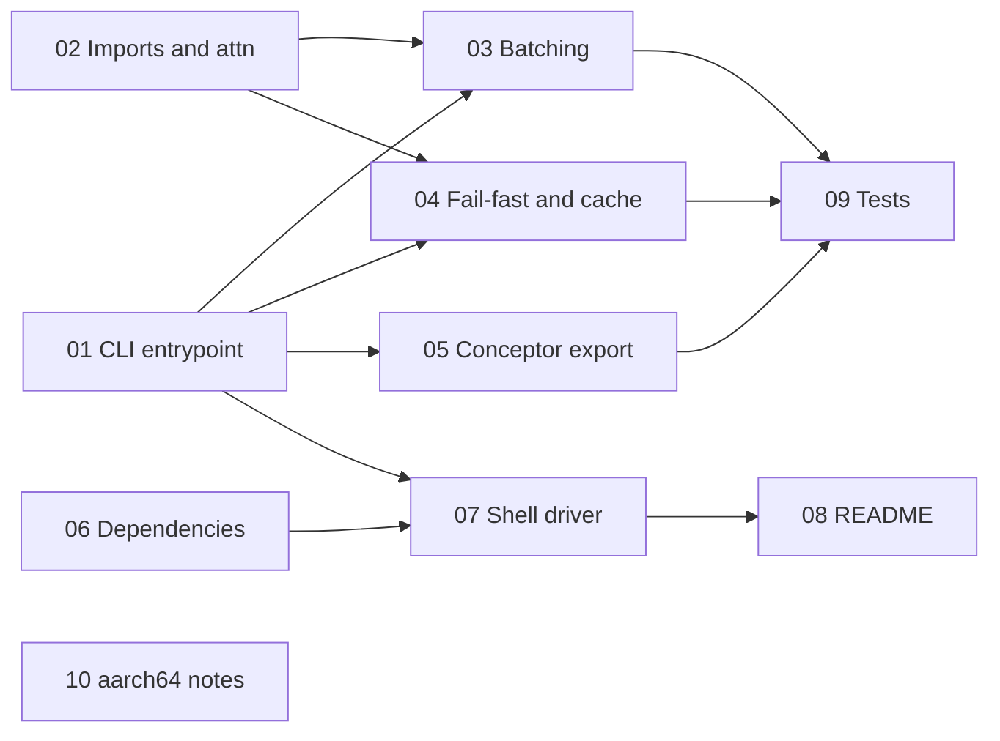

# Finalize `traycer/calm-lemur` to a functioning state

Handoff document for an executing model. Read this file **and** the referenced ticket  
before touching anything. Every ambiguous decision below was settled with the repo owner  
on 2026-08-12 — do not re-litigate them, and do not substitute your own judgement where  
this document is explicit.

## Current state

The branch (`24a1b34`, identical to `mainmrg`) **does not run and does not even parse**.  
`create_control_vectors.py` contains a literal syntax error, has no callable entrypoint,  
and `hidden_state_data_manager.py` raises `NameError` on import. The `--conceptors` path  
is broken by a type mismatch introduced when `ConceptorRepresentation` was added. The  
shell driver and the entire README document a CLI that no longer exists.

## Target platform

The real workload runs on a **DGX Spark (GB10, aarch64/sbsa, CUDA)**. The pipeline is  
**CUDA-only by decision** — do *not* add CPU support or a `--device` flag.

## Settled decisions


| Question                        | Decision                                                                                                                                                                                                                |
| ------------------------------- | ----------------------------------------------------------------------------------------------------------------------------------------------------------------------------------------------------------------------- |
| CLI flag naming                 | Keep the **new** hyphenated names (`--model`, `--outpath`, `--prompts`, `--continuations`, `--writing-prompts-file`, `--num-samples`, `--precision`, ...). Fix `create_all_control_vectors.sh` and the README to match. |
| CPU support                     | **Out of scope.** CUDA-only. No `--device` flag, no CPU fallback.                                                                                                                                                       |
| Default device                  | `torch.set_default_device("cuda")`, and pass the literal `"cuda"` to every `ModelHandler`. No CPU reload for the export step.                                                                                           |
| `--conceptors` scope            | Repair the interface so it runs. Do **not** deep-verify low-rank/centering correctness.                                                                                                                                 |
| Low-rank conceptor export       | **Reconstruct to a full matrix** (`reconstruct_conceptor(U, s)`) and always write a single `conceptor.{layer}` tensor. Both paths produce identical GGUF layout.                                                        |
| Batched extraction              | **Fix it** — switch to left-padding so index `-1` is a real token. Include a batch-vs-single equivalence test.                                                                                                          |
| Attention impl                  | Add a `--attn {none,flash,sdpa,eager}` CLI flag. `none` = let Transformers auto-select.                                                                                                                                 |
| flash-attn dependency           | Move to a **separate `requirements-flash.txt`**; remove from `requirements.txt`.                                                                                                                                        |
| Error handling                  | **Fail fast** — re-raise instead of print-and-continue. Never write a partial `.pt` cache.                                                                                                                              |
| Cache validation                | **Shape checks only** on load (class count, per-class sample count, layer count, feature dim). No metadata header, no format change.                                                                                    |
| `create_all_control_vectors.sh` | **Trim** to only continuation files that exist on this branch.                                                                                                                                                          |
| Layer-skip fractions            | **Drop the fraction claim.** Keep `type=int`, delete the unreachable `0 < x < 1` branches and the misleading help/README text.                                                                                          |
| Changed defaults                | **Intentional — keep them.** `--skip-early-layers=1`, `--gate=0.3`, system prompt on by default. Only make the docs describe them accurately.                                                                           |
| Conceptor filenames             | Use **class names**: `<outpath>_conceptor_debias.gguf`, `<outpath>_conceptor_sadism.gguf`, ... mirroring the control-vector naming.                                                                                     |
| Tests                           | Author a `pytest` suite. **Do not install anything and do not run it** — no torch is available on this box. Tests will be run on the Spark.                                                                             |
| aarch64 notes                   | In scope. Research and document GB10/sbsa availability of `bitsandbytes` and `flash-attn`.                                                                                                                              |
| Commits                         | **None.** Leave the working tree dirty for the owner to review.                                                                                                                                                         |


## Hard constraints for the executing model

- **Do not commit, stage, amend, push, or create branches.** Leave everything uncommitted.
- **Do not install packages.** There is no Python environment on this machine with  
`torch`, `transformers`, or `gguf`. `C:\ProgramData\miniconda3\python.exe` exists and has  
a stdlib, but nothing else.
- **Do not download models** — not in code, not in tests, not for verification.
- **Do not change the numerical algorithm.** `direction_analyzer.py`'s eigen/discriminant  
logic and `conceptor_analyzer.py`'s conceptor math are correct as written; only the dead  
fraction branches and an unused import come out.
- **Do not add CI**, pre-commit hooks, formatters, or type checkers.
- **Do not refactor `ModelHandler` for multimodal / `AutoConfig` / GGUF-as-source.** Those  
are explicitly deferred in `docs/model_support_notes.md`.
- If you hit something this document does not cover and the choice is consequential,  
**stop and ask** rather than guessing.

## Ticket order

Tickets 01 and 02 unblock everything else — the repo cannot even be imported until both  
land. After that, 03/04/05 are independent of each other, and 06→07→08 are documentation  
and packaging. 09 depends on 01–05 existing. 10 is independent.




| #   | Ticket                                                                      | Files touched                                                                                     |
| --- | --------------------------------------------------------------------------- | ------------------------------------------------------------------------------------------------- |
| 01  | [Repair the CLI entrypoint](./01-cli-entrypoint/index.md)                   | `create_control_vectors.py`                                                                       |
| 02  | [Fix imports and add attention selection](./02-imports-and-attn/index.md)   | `hidden_state_data_manager.py`, `model_handler.py`                                                |
| 03  | [Correct batched hidden-state extraction](./03-batched-extraction/index.md) | `hidden_state_data_manager.py`                                                                    |
| 04  | [Fail fast and validate the sample cache](./04-failfast-and-cache/index.md) | `hidden_state_data_manager.py`                                                                    |
| 05  | [Repair the conceptor export interface](./05-conceptor-export/index.md)     | `model_handler.py`, `conceptor_analyzer.py`, `direction_analyzer.py`, `create_control_vectors.py` |
| 06  | [Split the dependency files](./06-dependencies/index.md)                    | `requirements*.txt`                                                                               |
| 07  | [Rewrite the shell driver](./07-shell-driver/index.md)                      | `create_all_control_vectors.sh`                                                                   |
| 08  | [Update the README](./08-readme/index.md)                                   | `README.md`                                                                                       |
| 09  | [Author the pytest suite](./09-tests/index.md)                              | `tests/**`                                                                                        |
| 10  | [Document GB10 / aarch64 support](./10-aarch64-notes/index.md)              | `docs/model_support_notes.md`                                                                     |


## Verification protocol

No torch means no import-level or runtime verification is possible here. The **only**  
evidence you may claim:

1. **Syntax** — every `.py` file in the repo root and `tests/` compiles:
  ```pwsh
   & C:\ProgramData\miniconda3\python.exe -m compileall -q .
  ```

   This must exit 0. It is a stdlib-only operation and works without torch.
2. **Static consistency** — a stdlib-only `ast` walk confirming: no undefined names in the  
 new argparse code, `if __name__ == "__main__":` present, and every flag string appearing  
 in `create_all_control_vectors.sh` also appears as an `add_argument` in  
 `create_control_vectors.py`. Ticket 09 turns this into a real test; you may also run it  
 ad-hoc as a script since it needs no third-party imports.
3. **Manual read-through** of each diff against its ticket's acceptance criteria.

You **may not** claim that the pipeline runs, that the tests pass, that a GGUF file is  
produced, or that any model loads. Your final report must contain a section titled  
`Unverified` that lists, explicitly:

- the pytest suite was authored but never executed (no torch on this host);
- no end-to-end run against a real model was performed;
- the `--conceptors` path was interface-repaired but not numerically verified (per decision);
- any aarch64 finding in ticket 10 that came from documentation rather than a real install.

## Reporting

Produce a short summary per ticket: what changed, why, and anything you found that the  
ticket did not anticipate. Flag any place where you had to make a judgement call the  
ticket left open — the owner wants those surfaced, not silently resolved.
